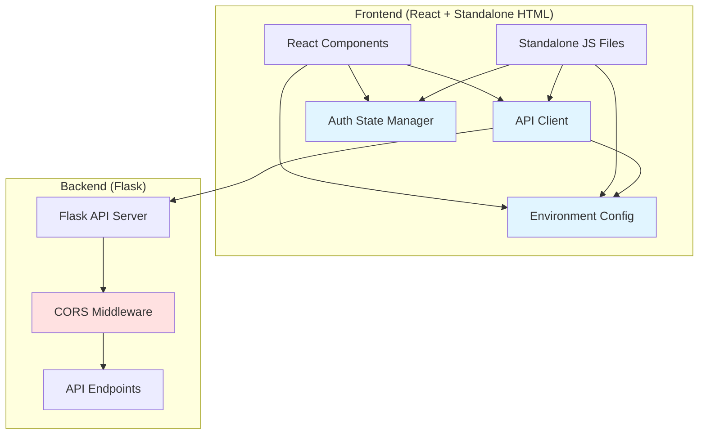
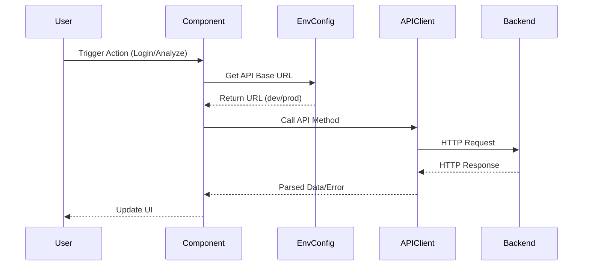

# Design Document: Frontend-Backend Integration

## Overview

This design document outlines the architecture and implementation approach for integrating the React frontend with the Flask backend API. The solution provides environment-aware configuration, centralized API client management, proper error handling, and seamless authentication state management across both React components and standalone HTML/JavaScript files.

The integration supports two primary environments:
- **Development**: Frontend (localhost:3000) communicates with Backend (localhost:5000)
- **Production**: Frontend and Backend deployed on cloud platforms with environment-based URLs

## Architecture

### High-Level Architecture



### Component Interaction Flow



## Components and Interfaces

### 1. Environment Configuration Module

**File**: `agreement-front-end--main/src/config/api.js`

**Purpose**: Centralized configuration for API URLs based on environment detection.

**Interface**:
```javascript
// api.js
const getApiBaseUrl = () => {
  // Check if running in development
  if (process.env.NODE_ENV === 'development') {
    return 'http://localhost:5000';
  }
  
  // Production: use environment variable or default
  return process.env.REACT_APP_API_URL || 'https://agreement-checker-backend.vercel.app';
};

export const API_BASE_URL = getApiBaseUrl();

export const API_ENDPOINTS = {
  REGISTER: '/api/register',
  LOGIN: '/api/login',
  ANALYZE: '/api/analyze',
  HISTORY: '/api/history',
  HEALTH: '/api/health'
};
```

**For Standalone HTML Files**: Create a separate configuration file that can be included via script tag:

**File**: `agreement-front-end--main/config.js`

```javascript
// config.js - For standalone HTML files
(function(window) {
  'use strict';
  
  const getApiBaseUrl = () => {
    // Check hostname to determine environment
    const hostname = window.location.hostname;
    
    if (hostname === 'localhost' || hostname === '127.0.0.1') {
      return 'http://localhost:5000';
    }
    
    // Production
    return 'https://agreement-checker-backend.vercel.app';
  };
  
  window.API_CONFIG = {
    BASE_URL: getApiBaseUrl(),
    ENDPOINTS: {
      REGISTER: '/api/register',
      LOGIN: '/api/login',
      ANALYZE: '/api/analyze',
      HISTORY: '/api/history',
      HEALTH: '/api/health'
    }
  };
})(window);
```

### 2. API Client Module

**File**: `agreement-front-end--main/src/services/apiClient.js`

**Purpose**: Centralized API communication layer with error handling and request formatting.

**Interface**:
```javascript
// apiClient.js
import { API_BASE_URL, API_ENDPOINTS } from '../config/api';

class APIClient {
  constructor(baseUrl) {
    this.baseUrl = baseUrl;
  }

  async request(endpoint, options = {}) {
    const url = `${this.baseUrl}${endpoint}`;
    
    try {
      const response = await fetch(url, {
        ...options,
        headers: {
          ...options.headers,
        }
      });

      const data = await response.json();

      if (!response.ok) {
        throw {
          status: response.status,
          message: data.error || 'Request failed',
          data
        };
      }

      return data;
    } catch (error) {
      if (error.status) {
        throw error;
      }
      throw {
        status: 0,
        message: 'Could not connect to the server. Please check your connection.',
        originalError: error
      };
    }
  }

  async register(email, password) {
    return this.request(API_ENDPOINTS.REGISTER, {
      method: 'POST',
      headers: { 'Content-Type': 'application/json' },
      body: JSON.stringify({ email, password })
    });
  }

  async login(email, password) {
    return this.request(API_ENDPOINTS.LOGIN, {
      method: 'POST',
      headers: { 'Content-Type': 'application/json' },
      body: JSON.stringify({ email, password })
    });
  }

  async analyzeDocument(formData) {
    return this.request(API_ENDPOINTS.ANALYZE, {
      method: 'POST',
      body: formData
      // Note: Don't set Content-Type for FormData, browser sets it automatically
    });
  }

  async getHistory(email) {
    return this.request(`${API_ENDPOINTS.HISTORY}/${email}`, {
      method: 'GET'
    });
  }

  async healthCheck() {
    return this.request(API_ENDPOINTS.HEALTH, {
      method: 'GET'
    });
  }
}

export const apiClient = new APIClient(API_BASE_URL);
```

### 3. Authentication State Manager

**File**: `agreement-front-end--main/src/services/authService.js`

**Purpose**: Manage user authentication state across the application.

**Interface**:
```javascript
// authService.js
const AUTH_STORAGE_KEY = 'userEmail';

export const authService = {
  login(email) {
    localStorage.setItem(AUTH_STORAGE_KEY, email);
    this.notifyListeners();
  },

  logout() {
    localStorage.removeItem(AUTH_STORAGE_KEY);
    this.notifyListeners();
  },

  getCurrentUser() {
    return localStorage.getItem(AUTH_STORAGE_KEY);
  },

  isAuthenticated() {
    return !!this.getCurrentUser();
  },

  // Simple event system for auth state changes
  listeners: [],

  addListener(callback) {
    this.listeners.push(callback);
  },

  removeListener(callback) {
    this.listeners = this.listeners.filter(cb => cb !== callback);
  },

  notifyListeners() {
    const user = this.getCurrentUser();
    this.listeners.forEach(callback => callback(user));
  }
};
```

### 4. Updated React Components

**AuthModal Component Updates**:
```javascript
// AuthModal.js
import React, { useState } from 'react';
import { apiClient } from '../services/apiClient';
import { authService } from '../services/authService';

const AuthModal = ({ isOpen, onClose, onLogin }) => {
  const [isLoginForm, setIsLoginForm] = useState(true);
  const [formData, setFormData] = useState({ email: '', password: '' });
  const [message, setMessage] = useState('');
  const [isLoading, setIsLoading] = useState(false);

  const handleSubmit = async (e) => {
    e.preventDefault();
    setIsLoading(true);
    setMessage('');

    try {
      const result = isLoginForm 
        ? await apiClient.login(formData.email, formData.password)
        : await apiClient.register(formData.email, formData.password);

      setMessage(result.message);
      if (result.email) {
        authService.login(result.email);
        onLogin(result.email);
      }
      setFormData({ email: '', password: '' });
    } catch (error) {
      setMessage(error.message);
    } finally {
      setIsLoading(false);
    }
  };

  // ... rest of component
};
```

### 5. Backend CORS Configuration Updates

**File**: `app.py`

**Updates Required**:
```python
# app.py - CORS Configuration Section
from flask_cors import CORS

# Configure CORS for both development and production
allowed_origins = [
    "http://localhost:3000",  # React dev server
    "http://localhost:5000",  # Flask serving static files
    "http://127.0.0.1:3000",
    "http://127.0.0.1:5000"
]

# Add production domain if in production
environment = os.getenv("ENVIRONMENT", "development")
if environment == "production":
    production_frontend = os.getenv("PRODUCTION_FRONTEND_URL")
    if production_frontend:
        allowed_origins.append(production_frontend)

CORS(app, 
     origins=allowed_origins,
     methods=["GET", "POST", "PUT", "DELETE", "OPTIONS"],
     allow_headers=["Content-Type", "Authorization"],
     supports_credentials=True)
```

### 6. Development Proxy Configuration

**File**: `agreement-front-end--main/src/setupProxy.js`

**Purpose**: Configure proxy for React development server to avoid CORS issues.

```javascript
// setupProxy.js
const { createProxyMiddleware } = require('http-proxy-middleware');

module.exports = function(app) {
  app.use(
    '/api',
    createProxyMiddleware({
      target: 'http://localhost:5000',
      changeOrigin: true,
      logLevel: 'debug'
    })
  );
};
```

**Alternative**: Add to `package.json`:
```json
{
  "proxy": "http://localhost:5000"
}
```

## Data Models

### API Request/Response Models

#### Authentication Request
```typescript
interface AuthRequest {
  email: string;
  password: string;
}
```

#### Authentication Response
```typescript
interface AuthResponse {
  message: string;
  email: string;
  id: number;
}
```

#### Analysis Request
```typescript
interface AnalysisRequest {
  file?: File;           // For file upload
  text?: string;         // For pasted text
  state: string;         // Selected state/location
  email: string;         // User email from auth state
}
```

#### Analysis Response
```typescript
interface AnalysisResponse {
  ratingText: string;
  ratingScore: number;
  shortSummary: string;
  aiSummary: string;
  redFlags: RedFlag[];
  fairClauses: FairClause[];
  recommendations: string[];
  redFlagsCount: number;
  fairClausesCount: number;
}

interface RedFlag {
  title: string;
  issue: string;
  recommendation: string;
  priority: 'high' | 'medium' | 'low';
}

interface FairClause {
  title: string;
  recommendation: string;
}
```

#### History Response
```typescript
interface HistoryItem {
  id: number;
  analysis_result: AnalysisResponse;
  created_at: string;  // ISO 8601 format
}

type HistoryResponse = HistoryItem[];
```

### Error Response Model
```typescript
interface ErrorResponse {
  status: number;
  message: string;
  data?: any;
  originalError?: Error;
}
```

## Correctness Properties


*A property is a characteristic or behavior that should hold true across all valid executions of a system—essentially, a formal statement about what the system should do. Properties serve as the bridge between human-readable specifications and machine-verifiable correctness guarantees.*

### Property 1: Environment Detection Consistency

*For any* environment (development or production), when the Environment_Config is initialized, it should return the correct API base URL that matches the current runtime environment without requiring manual configuration changes.

**Validates: Requirements 1.1, 1.2, 1.5**

### Property 2: API Client URL Construction

*For any* API method call (register, login, analyze, history), the constructed request URL should be the concatenation of the Environment_Config base URL and the endpoint path.

**Validates: Requirements 1.4, 2.2**

### Property 3: Request Header Inclusion

*For any* API request that requires JSON data, the request headers should include `Content-Type: application/json`, and for any authenticated request, appropriate authorization headers should be included.

**Validates: Requirements 2.3**

### Property 4: Response Parsing Consistency

*For any* successful API response (status 2xx), the API_Client should parse the JSON body and return a structured data object matching the expected response model.

**Validates: Requirements 2.4**

### Property 5: Error Response Structure

*For any* failed API request, the API_Client should throw an error object containing a status code, a descriptive message, and the original error data, with network errors mapped to status 0 and message "Could not connect to server".

**Validates: Requirements 2.5, 7.3, 7.4, 7.5**

### Property 6: Authentication State Persistence

*For any* authentication state change (login, register, logout), the Auth_State should correctly update localStorage: storing the email on successful login/register, and removing it on logout.

**Validates: Requirements 4.2, 4.4, 4.5**

### Property 7: UI Auth State Synchronization

*For any* change to the Auth_State, all UI components that depend on authentication status should update to reflect the current state (showing/hiding login buttons, user icons, protected content).

**Validates: Requirements 4.6**

### Property 8: Analysis Request Completeness

*For any* document analysis request (file upload or text paste), the request should include the user's email from Auth_State, the selected state/location, and the document content in the appropriate format (multipart/form-data for files, JSON for text).

**Validates: Requirements 5.3, 5.4**

### Property 9: Async Operation UI Feedback

*For any* pending API request, the Frontend should display loading indicators on relevant UI elements and disable submit buttons to prevent duplicate submissions, and upon completion (success or failure), should remove loading states and re-enable buttons.

**Validates: Requirements 5.5, 7.1, 7.6**

### Property 10: Analysis Results Display Completeness

*For any* successful analysis response, the displayed results should include all required fields: rating score, rating text, short summary, AI summary, red flags list, fair clauses list, and recommendations list.

**Validates: Requirements 5.6**

### Property 11: Error Message Display

*For any* failed API request, the Frontend should display a user-friendly error message to the user, with the message content determined by the error type (network error, client error, server error).

**Validates: Requirements 5.7, 6.3, 7.2**

### Property 12: History Data Ordering

*For any* history response containing multiple analysis records, the displayed results should be sorted by creation date in descending order (newest first).

**Validates: Requirements 6.2**

### Property 13: Protected Route Access Control

*For any* attempt to access protected features (history page, document analysis), the Frontend should verify authentication status and redirect unauthenticated users to the login modal or home page.

**Validates: Requirements 6.4**

### Property 14: Standalone File Configuration Consistency

*For any* API request made from standalone JavaScript files (script.js, analyzer.js, history.js), the request should use the same Environment_Config base URL and follow the same error handling patterns as React components.

**Validates: Requirements 10.2, 10.3, 10.4**

## Error Handling

### Error Categories

1. **Network Errors**: Connection failures, timeouts, DNS resolution failures
   - Status Code: 0
   - User Message: "Could not connect to the server. Please check your connection."
   - Action: Display error message, keep form data, allow retry

2. **Client Errors (4xx)**: Invalid input, authentication failures, not found
   - Status Code: 400-499
   - User Message: Display error message from backend response
   - Action: Display error message, highlight invalid fields if applicable

3. **Server Errors (5xx)**: Backend crashes, database failures, internal errors
   - Status Code: 500-599
   - User Message: "Server error occurred. Please try again later."
   - Action: Display error message, log error details for debugging

### Error Handling Strategy

```javascript
// Error handling in API Client
async request(endpoint, options = {}) {
  try {
    const response = await fetch(url, options);
    const data = await response.json();

    if (!response.ok) {
      throw {
        status: response.status,
        message: data.error || 'Request failed',
        data
      };
    }

    return data;
  } catch (error) {
    // Network error (fetch failed)
    if (!error.status) {
      throw {
        status: 0,
        message: 'Could not connect to the server. Please check your connection.',
        originalError: error
      };
    }
    // Re-throw API errors
    throw error;
  }
}

// Error handling in components
try {
  const result = await apiClient.login(email, password);
  // Handle success
} catch (error) {
  if (error.status === 0) {
    setMessage('Could not connect to the server. Please check your connection.');
  } else if (error.status >= 400 && error.status < 500) {
    setMessage(error.message);
  } else {
    setMessage('Server error occurred. Please try again later.');
  }
}
```

### Retry Strategy

- **Network Errors**: Allow immediate retry with same data
- **Client Errors**: Require user to fix input before retry
- **Server Errors**: Suggest retry after delay, implement exponential backoff for automated retries

## Testing Strategy

### Dual Testing Approach

This feature requires both unit tests and property-based tests to ensure comprehensive coverage:

- **Unit tests**: Verify specific examples, edge cases, and error conditions
- **Property tests**: Verify universal properties across all inputs

Both testing approaches are complementary and necessary for comprehensive coverage. Unit tests catch concrete bugs in specific scenarios, while property tests verify general correctness across a wide range of inputs.

### Unit Testing

Unit tests should focus on:

1. **Specific Examples**:
   - Environment detection returns correct URL for localhost
   - Environment detection returns correct URL for production domain
   - API client methods exist and have correct signatures
   - CORS allows specific origins and methods
   - Authentication endpoints are called with correct data
   - Analysis endpoints handle file uploads correctly
   - History endpoint constructs correct URL with email parameter

2. **Edge Cases**:
   - Empty environment variables fallback to defaults
   - Missing localStorage support (graceful degradation)
   - Malformed JSON responses
   - Empty history arrays
   - Missing required fields in responses

3. **Error Conditions**:
   - Network timeout handling
   - 401 Unauthorized responses
   - 404 Not Found responses
   - 500 Internal Server Error responses
   - CORS preflight failures

### Property-Based Testing

Property tests should be configured with:
- **Minimum 100 iterations** per test (due to randomization)
- **Tag format**: `Feature: frontend-backend-integration, Property {number}: {property_text}`

Property tests should focus on:

1. **Property 1: Environment Detection Consistency**
   - Generate various environment configurations
   - Verify correct URL is returned for each environment

2. **Property 2: API Client URL Construction**
   - Generate random endpoint paths
   - Verify URLs are correctly constructed with base URL

3. **Property 5: Error Response Structure**
   - Generate various error scenarios (network, 4xx, 5xx)
   - Verify error objects have correct structure and messages

4. **Property 6: Authentication State Persistence**
   - Generate random email addresses
   - Verify localStorage operations for login/logout

5. **Property 9: Async Operation UI Feedback**
   - Generate random API call scenarios
   - Verify loading states are correctly managed

6. **Property 12: History Data Ordering**
   - Generate random history arrays with various dates
   - Verify sorting is always newest-first

### Integration Testing

Integration tests should verify:
- Frontend can successfully connect to backend in development
- Frontend can successfully connect to backend in production
- Authentication flow works end-to-end
- Document analysis flow works end-to-end
- History retrieval works end-to-end
- Error handling works across the full stack

### Testing Tools

- **Unit Testing**: Jest, React Testing Library
- **Property-Based Testing**: fast-check (JavaScript property testing library)
- **Integration Testing**: Cypress or Playwright for E2E tests
- **API Testing**: Supertest for backend endpoint testing

### Example Property Test

```javascript
// Example property test using fast-check
import fc from 'fast-check';
import { apiClient } from './apiClient';

// Feature: frontend-backend-integration, Property 2: API Client URL Construction
test('API client constructs URLs correctly for all endpoints', () => {
  fc.assert(
    fc.property(
      fc.constantFrom('register', 'login', 'analyze', 'history'),
      (endpoint) => {
        const baseUrl = 'http://localhost:5000';
        const expectedUrl = `${baseUrl}/api/${endpoint}`;
        
        // Mock fetch to capture the URL
        const originalFetch = global.fetch;
        let capturedUrl;
        global.fetch = jest.fn((url) => {
          capturedUrl = url;
          return Promise.resolve({
            ok: true,
            json: () => Promise.resolve({})
          });
        });

        // Make API call
        apiClient.request(`/api/${endpoint}`, { method: 'GET' });

        // Verify URL construction
        expect(capturedUrl).toBe(expectedUrl);

        // Restore fetch
        global.fetch = originalFetch;
      }
    ),
    { numRuns: 100 }
  );
});
```

## Implementation Notes

### Development Workflow

1. **Start Backend**: `python app.py` (runs on localhost:5000)
2. **Start Frontend**: `npm start` (runs on localhost:3000)
3. **Proxy Configuration**: React dev server proxies `/api/*` to backend
4. **Hot Reload**: Both frontend and backend support hot reload during development

### Production Deployment

1. **Environment Variables**:
   - Backend: `ENVIRONMENT=production`, `PRODUCTION_FRONTEND_URL=https://your-frontend.vercel.app`
   - Frontend: `REACT_APP_API_URL=https://your-backend.vercel.app`

2. **Build Process**:
   - Frontend: `npm run build` creates optimized production build
   - Backend: Deploy with environment variables configured

3. **CORS Configuration**: Backend automatically includes production frontend URL in allowed origins

### Migration Path for Standalone Files

1. Create `config.js` with environment detection
2. Include `config.js` in HTML files before other scripts
3. Update `script.js`, `analyzer.js`, `history.js` to use `window.API_CONFIG.BASE_URL`
4. Test all functionality in both development and production
5. Remove hardcoded URLs

### Security Considerations

- Never expose sensitive API keys in frontend code
- Use HTTPS in production for all API communication
- Implement CSRF protection for state-changing operations
- Validate and sanitize all user inputs on backend
- Use secure, httpOnly cookies for session management (future enhancement)
- Implement rate limiting on backend endpoints
